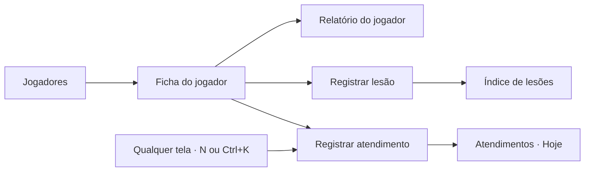

# Fisioterapia EC Santo André

Sistema web do departamento de saúde do EC Santo André para a fisioterapia registrar e acompanhar cada jogador. Substitui a planilha "Controle de atendimentos diários", a planilha "Índice de lesões" e o Power BI.

## Como este arquivo se organiza

| Parte | O que define | Onde |
|---|---|---|
| **Produto** | o conceito: o que cada tela faz, campos, fluxos, regras e cálculos | este arquivo, de [Produto](#produto) em diante |
| **Design** | como tudo aparece: tipos de página, tokens, cores, componentes, estados | [`docs/design.md`](docs/design.md) — **toda UI segue esse arquivo** |
| **Arquitetura** | stack, pastas, rotas, dados e permissões | [Arquitetura](#arquitetura) |
| **Decisões** | onde o prompt original estava incompleto ou em conflito, e o que foi decidido | [Decisões e correções](#decisões-e-correções) |

O prompt original descrevia o visual do MVP antigo (azul-marinho, amarelo, Barlow Condensed, medidas em px). **Esse visual não é usado.** Do prompt vale o conceito; o visual vem de `docs/design.md` (Preset 3 · Admin/Dados como base, com barra de comando, atalhos e modo escuro do Preset 1).

**Para pedir mudanças:** edite o trecho e cole na conversa. Dúvidas entre colchetes, por exemplo `[confirmar com o Thales]`. Colchetes em maiúsculas, como `[NOME DO FISIOTERAPEUTA]`, são informação que ainda falta. Os nomes de jogadores do banco de demonstração são fictícios.

---

# Arquitetura

## Stack

| Parte | Escolha | Por quê |
|---|---|---|
| App | Next.js 16 (App Router, Server Components, Server Actions), React 19, TypeScript | telas renderizadas no servidor já com os números calculados; gravação sem API separada |
| UI | Tailwind CSS v4 + fonte Geist + componentes shadcn/ui em `src/components/ui` (Radix UI por baixo), `cmdk` para a barra de comando, `sonner` para toasts | design system único exigido pelos presets |
| Cor | `@radix-ui/colors` (gray, blue, green, amber, red) + tinta `#171717` e azul do clube `#1f4f9c` | escalas de 12 passos com papel fixo e modo escuro |
| Ícones | `lucide-react` | |
| Banco | PostgreSQL via Drizzle ORM. Desenvolvimento: PGlite (Postgres embutido em `.data/pglite`). Produção: `DATABASE_URL` | mesmo dialeto nos dois ambientes; migrações versionadas em `drizzle/` |
| Validação | `zod` nas Server Actions | |
| Testes | Vitest nas regras de negócio (`src/lib/dominio`) | status e números são o coração do sistema |

## Comandos

```bash
npm run dev          # http://localhost:3000 · cria e popula o banco de demonstração na 1ª vez
npm run test         # regras de status e cálculos
npm run typecheck    # tsc --noEmit
npm run lint         # eslint
npm run db:generate  # gera migração em drizzle/ depois de mudar src/db/schema.ts
npm run db:reset     # apaga .data/ (banco e arquivos) para recomeçar a demonstração
```

Antes de cada commit: `npm run typecheck && npm run lint && npm run test`.

## Pastas

```
src/app/(app)/            telas com a navegação lateral
  atendimentos/           índice · novo · [id]/editar
  jogadores/              índice · novo · [id] (ficha) · [id]/editar · [id]/relatorio
  lesoes/                 índice · nova · [id]/editar · [id]/retorno
  painel/                 índice agregado
  configuracoes/          listas, campeonatos, usuários
src/app/celular/          registrar atendimento no celular (sem navegação)
src/app/api/arquivos/     entrega de fotos e documentos com checagem de perfil
src/components/ui/        componentes shadcn/ui (botão, input, tabela, badge, tabs, toggle-group…)
src/components/           componentes do produto (manequim, gráficos, badge de status, app shell…)
src/lib/dominio/          regras puras: status do atleta, cálculos, datas, mapa de queixas. Tudo testado
src/lib/catalogos.ts      listas da planilha (HD, locais, objetivos, posições, campeonatos e datas)
src/lib/consultas/        leitura do banco (só no servidor)
src/lib/acoes/            Server Actions (gravação), sempre começando por exigir()
src/lib/sessao.ts         usuário atual e permissões
src/db/                   schema Drizzle, conexão, migração e dados de demonstração
drizzle/                  migrações SQL geradas
docs/design.md            design do sistema
```

## Rotas e tipos de página

| Rota | Tipo | Tela |
|---|---|---|
| `/` | — | redireciona pelo perfil: Fisioterapia → `/atendimentos`; Médico e Comissão → `/painel`; celular → `/celular` |
| `/atendimentos` | Índice | Atendimentos (visão padrão: Hoje) |
| `/atendimentos/novo?atleta=:id` | Formulário | Registrar atendimento |
| `/atendimentos/:id/editar` | Formulário | Editar atendimento |
| `/jogadores` | Índice | Jogadores |
| `/jogadores/novo` | Formulário | Adicionar jogador (3 etapas) |
| `/jogadores/:id?aba=` | Detalhe | Ficha do jogador |
| `/jogadores/:id/editar` | Formulário | Editar jogador |
| `/jogadores/:id/relatorio?de=&ate=` | Detalhe (impressão) | Relatório do jogador |
| `/lesoes` | Índice | Índice de lesões |
| `/lesoes/nova?atleta=:id` | Formulário | Registrar lesão |
| `/lesoes/:id/editar` · `/lesoes/:id/retorno` | Formulário | Editar lesão · Registrar retorno |
| `/painel?periodo=&campeonato=` | Índice agregado | Painel |
| `/configuracoes/*` | Formulário (settings) | Listas, Campeonatos, Usuários |
| `/celular` | Formulário | Registrar atendimento no celular |

## Regras para quem programa

- **Nada calculado é gravado.** Status e totais saem de `src/lib/dominio` a partir dos registros, a cada leitura.
- **"Hoje" é no horário de Brasília** (`hojeISO()` em `src/lib/dominio/datas.ts`). O servidor roda em UTC.
- **Toda Server Action começa com `exigir("editar")`** (`src/lib/sessao.ts`). Server Actions aceitam POST direto; esconder o botão não basta. Rotas que entregam arquivos checam `permissoes()`.
- **Formulários tratam o resultado dentro da própria action** (`useActionState(async (anterior, form) => { const r = await salvarX(anterior, form); ... })`), nunca num `useEffect`.
- **Botões que trocam de papel no mesmo lugar** (Continuar → Salvar) precisam de `key` diferentes, senão o React reaproveita o elemento e o clique envia o formulário.
- **Listas vêm de `src/lib/catalogos.ts`.** Nunca escrever uma opção direto numa tela. O banco guarda a chave; a tela mostra o rótulo.
- **Filtros, busca, ordenação, página e aba vivem na URL.**
- **Mudou uma regra de cálculo:** atualize o teste em `src/lib/dominio/*.test.ts` e a tabela [Como cada número é calculado](#como-cada-número-é-calculado).
- **UI:** siga `docs/design.md` e rode o checklist do fim dele antes de entregar uma tela.

@AGENTS.md

---

# Produto

## Contexto e objetivo

**Como é hoje:** o atleta passa na fisioterapia e o fisioterapeuta preenche uma linha na planilha "Controle de atendimentos diários" (atleta, posição, HD, local da queixa, objetivo do trabalho, status, período, data). Quando o jogador se machuca e fica fora, preenche outra planilha, o "Índice de lesões". Os gráficos ficavam num Power BI feito por outra pessoa, que o departamento não sabe editar.

**O que o sistema resolve:**

- Registro rápido do atendimento, pelo computador ou pelo celular, com os mesmos campos da planilha.
- Uma ficha por jogador com tudo dele: queixas no corpo, atendimentos, lesões, testes e documentos.
- Painéis que se atualizam sozinhos a partir dos registros, no lugar do Power BI.
- Quem tem acesso vê tudo na hora, sem enviar planilha ou link.

**Foco:** facilidade de uso. Cada informação aparece em um lugar só, sem repetição entre telas.

## Usuários e permissões

Três perfis. A fisioterapia alimenta; os outros consultam.

| Perfil | O que pode fazer |
|---|---|
| **Fisioterapia** (administrador) | Tudo: cadastrar e editar jogadores, registrar, editar e excluir atendimentos e lesões, registrar retorno, enviar documentos, configurar listas e campeonatos |
| **Médico** | Ver tudo, incluindo laudos, exames, evolução e dados de saúde. Não edita |
| **Comissão técnica e clube** | Ver status, painel, fichas e relatórios. Não vê a aba Documentos, a evolução em texto, a estrutura e a observação da lesão, nem os dados de saúde do cadastro. Não edita |

Enquanto não existe login, o menu do usuário tem "Trocar perfil (demonstração)", que grava o perfil num cookie para testar as três visões. Login e gestão de usuários estão nas [Pendências](#pendências).

## Navegação

- **Lateral:** escudo e nome do clube, o botão preto **Registrar atendimento**, "Buscar jogador" e 4 itens: Atendimentos, Jogadores, Lesões, Painel (com contadores discretos: atendimentos de hoje, afastados, lesões em aberto).
- **Menu do perfil** (avatar no canto superior direito): Configurações, tema claro/escuro, trocar perfil (demonstração) e Sair.
- Topo: caminho de navegação clicável ("Jogadores / Rafael Moura"), Avisos e o menu do perfil.
- **Registrar atendimento** é a ação principal do sistema e fica **sempre no mesmo lugar**: o botão preto no topo da lateral, em todas as telas. Na ficha de um jogador ele vira "Atendimento do Rafael" e já abre com ele escolhido. Também no atalho `N` e na barra de comando. Nenhuma tela repete esse botão.
- **Barra de comando (Ctrl/Cmd+K):** busca jogador por nome ou apelido (a camisa também acha, quando existe); vai para qualquer tela; dispara Registrar atendimento, Registrar lesão e Adicionar jogador.
- **Celular:** só a tela de registrar atendimento, sem navegação, para a fisio usar na sala. Abrir o sistema no celular leva direto para ela.



## Tela: Atendimentos

A planilha diária virada tela. Abre na visão **Hoje**: todos os atendimentos registrados no dia, em tempo real (a lista se atualiza sozinha a cada 20 s e ao voltar para a aba).

- **Cabeçalho:** "Atendimentos" com a contagem, a data por extenso ("Quarta-feira, 23 de setembro") e o resumo "6 em tratamento · 3 queixa pós-treino". Ação: Exportar (CSV). Registrar atendimento é o botão da lateral.
- **Visões:** Hoje, Ontem, 7 dias, Temporada. Na visão Hoje, setas para o dia anterior e o seguinte (`?data=2026-09-22`).
- **Filtros:** período (matutino, vespertino), status, HD, local, objetivo; busca por atleta.
- **Tabela** com as colunas da planilha: atleta, status, posição, HD, local da queixa, objetivo do trabalho, status, período e registrado há. Clicar na linha abre a ficha. `···`: Editar, Excluir (Fisioterapia).

## Tela: Registrar atendimento

A tela mais usada e a que alimenta todo o resto. Deve ser concluída em 2 ou 3 toques para quem volta todo dia.

**Regra de ouro:** ao escolher o atleta, o formulário vem preenchido com o último atendimento dele. A fisio muda só o que for diferente. Data (hoje) e período (matutino antes das 12h, vespertino depois, no horário de Brasília) entram sozinhos.

Grupos, nesta ordem:

1. **Atleta:** atleta (busca por nome ou apelido), data do atendimento e período. A posição aparece sozinha, vinda do cadastro.
2. **Queixa:** HD (tendinopatia, DMT, contratura, entorse, lesão muscular, outro) e local da queixa (joelho, posterior de coxa, anterior de coxa, panturrilha, adutor, lombar, tornozelo, quadril, ombro, pé, outro), como botões de opção.
3. **Trabalho de hoje:** objetivo do trabalho (força muscular, estabilidade, relaxamento Mm., HIIT + CORE, potência, cardio (volume), recovery), status (em tratamento ou queixa pós-treino) e a evolução do dia em texto livre (opcional).

- **Lateral de contexto:** os últimos 14 dias do jogador (velas) e o resumo do último atendimento.
- **Botões:** "Salvar e registrar outro" (secundário) e "Salvar atendimento" (primário). Ao salvar, toast: "Atendimento salvo. Já aparece na ficha e em Atendimentos de hoje."
- **Um atendimento por atleta, data e período.** Se já existe, o formulário avisa e oferece editar o existente.

**Celular** (`/celular`), para a sala:

- Cabeçalho com "Novo atendimento" e a data.
- **"Quem está na sala?":** atalhos com os jogadores mais atendidos nos últimos 14 dias.
- **"Mesmo de ontem?":** resumo do último atendimento do jogador escolhido e o botão "Repetir e ajustar", que copia HD, local, objetivo e status. No celular os campos só vêm preenchidos por esse botão, para a fisio confirmar com um toque: escolher o jogador → Repetir e ajustar → Salvar = 3 toques.
- Um bloco por campo, na mesma ordem do computador, e "Salvar atendimento" fixo no rodapé.
- Depois de salvar: confirmação e o botão "Registrar o próximo".

## Tela: Jogadores

O elenco, feito para achar um jogador rápido. Só identifica e mostra o status; a análise fica na ficha.

- **Cabeçalho:** "Jogadores" com a contagem do elenco. Ação: **Adicionar jogador** (Fisioterapia).
- **Visões:** Todos, Goleiros, Defensores, Meio-campistas, Atacantes, Afastados, Fora do elenco. Grupos: goleiro → Goleiros; zagueiro e lateral → Defensores; volante e meia → Meio-campistas; extremo e atacante → Atacantes.
- **Busca** por nome ou apelido.
- **Tabela:** jogador (foto + nome + apelido e, se houver, a camisa), status, posição, idade. Ordem alfabética. Clicar abre a ficha. `···`: Abrir ficha, Editar, Registrar lesão.
- Não mostrar gráficos nem contagens por jogador aqui.

## Tela: Adicionar jogador

Cadastro em 3 etapas, uma de cada vez, com indicador de progresso e botões Voltar e Continuar. Na última etapa, "Salvar jogador".

1. **Quem é:** foto, nome completo, apelido (como ele é chamado) e data de nascimento.
2. **No time:** número da camisa (**opcional**; quando informado, não pode repetir entre jogadores ativos), posição (goleiro, zagueiro, lateral, volante, meia, extremo, atacante), altura, peso e pé dominante (destro, canhoto, ambidestro).
3. **Saúde (opcional):** alergias ou medicamentos de uso contínuo, lesões anteriores e exames admissionais, que vão direto para a pasta do jogador.

- Ao lado, uma prévia de como o jogador vai aparecer na lista (foto, nome, apelido, posição e camisa, se houver), atualizada enquanto a fisio digita.
- Ao salvar: toast "Rafael foi adicionado. Ele já aparece na lista de jogadores." e redireciona para a ficha.

## Tela: Ficha do jogador

Tudo sobre um jogador, dividido em abas. Cada informação aparece em uma aba só.

**Cabeçalho:** foto, nome, camisa (se houver) e status. Ações: Relatório e `···` (Registrar lesão, Editar cadastro). O registro de atendimento é o botão da lateral, que na ficha já vem com o jogador. Para ir a outro jogador, "Buscar jogador" na lateral. Clicar na foto troca a foto (Fisioterapia).

**Abas:** Visão geral, Atendimentos, Lesões, Testes, Documentos (a aba fica na URL).

### Visão geral

Conteúdo principal (2/3):

- **Mapa de queixas:** manequim de frente e de costas, lado a lado. As regiões com queixa aparecem destacadas dentro do corpo; a queixa atual em destaque forte, as antigas em destaque suave; a região selecionada com contorno tracejado. Ao lado, a lista das regiões: nome, tipo de queixa, "atual" ou "antiga" e o número de atendimentos. Selecionar uma região destaca no corpo e mostra o resumo, por exemplo "9 atendimentos em 10 semanas, 2 lesões registradas aqui".
- **Frequência · 14 dias:** gráfico de velas, uma por dia, altura = número de atendimentos, cor pelo status. Dia sem atendimento = tracinho. Total no topo, "hoje" no fim do eixo.

Lateral (1/3):

- **Perfil:** posição, idade, altura, peso e pé.
- **Hoje:** período e horário, o objetivo trabalhado e a evolução do dia. Não repete HD, local nem status. Sem atendimento hoje: "Sem atendimento hoje · último em 20/09".
- **Objetivo do trabalho · 30 dias:** barras horizontais com o número no fim.

### Atendimentos

- **Períodos de tratamento:** do mais recente para o mais antigo, com datas, status e descrição. Exemplo: "20/09 – hoje · Em tratamento · Tendinopatia · joelho". Um período é uma sequência de atendimentos com o mesmo HD e local, sem intervalo maior que 7 dias.
- **Histórico:** tabela com data, período, HD, local, objetivo e status. `···`: Editar, Excluir.

### Lesões

Índice de lesões só deste jogador: dia, lesão, região e lado, reincidência, afastamento ("Em aberto" quando não tem fim), campeonato e período. Ação: Registrar lesão. `···`: Registrar retorno (lesão em aberto), Editar, Excluir.

### Testes

Quatro blocos: dinamometria de joelho, de quadril e de ombro, e hop tests, cada um com campos, gráfico e data da última avaliação `[campos a definir quando chegar o modelo da planilha]`. Até lá, cada bloco mostra o estado vazio "Aguardando o modelo da planilha".

### Documentos

Pasta do jogador com as pastas Exames de imagem, Laudos, Avaliações e Outros (com a quantidade de arquivos), a lista de arquivos (nome, tipo, enviado por, quando) e uma área para enviar arquivo (Fisioterapia). Não aparece para a Comissão técnica.

## Telas: Lesões

### Índice de lesões

A planilha de lesões do elenco virada tela.

- **Cabeçalho:** "Lesões" com a contagem e a linha de resumo calculada da lista filtrada: "12 lesões · 3 em aberto · reincidência 17% · afastamento médio 12 dias · 180 dias perdidos". Ações: **Registrar lesão** e Exportar (CSV).
- **Visões:** Todas, Em aberto, Encerradas.
- **Filtros:** campeonato (Paulistão, Copa Paulista, Série D, amistoso), período (pré-temporada, temporada), tipo, região; busca por atleta. Filtrar recalcula o resumo.
- **Tabela:** atleta, posição, dia, lesão, região e lado, reincidência, afastamento ("Em aberto" em destaque quando não tem fim), retorno, campeonato e período. Clicar abre a ficha na aba Lesões. `···`: Registrar retorno, Editar, Excluir.
- A distribuição por região e por tipo fica no Painel (um lugar por informação).

### Registrar lesão

Para quando o jogador se machuca e fica fora de treinos e jogos.

1. **A lesão:** atleta, dia da lesão, tipo (contratura, tendinopatia, entorse, lesão muscular, lesão ligamentar, outra), estrutura em texto (opcional, ex.: bíceps femoral) e reincidência (não ou sim). Reincidência vem sugerida "sim" se o atleta já teve lesão na mesma região e lado.
2. **Onde foi:** manequim de frente e de costas. A fisio escolhe a região (joelho, tornozelo, anterior de coxa, adutor, quadril, ombro, pé, posterior de coxa, panturrilha, lombar, outro) tocando no corpo ou na lista, e o lado (direito, esquerdo ou bilateral). Tocar no corpo já define o lado. O local fica destacado no corpo na hora e, embaixo, a confirmação: "Contratura · joelho direito · aparece no mapa de queixas da ficha".
3. **Afastamento:** dias de afastamento (pode ficar em aberto), campeonato, período (pré-temporada ou temporada, sugerido pela data) e observação (opcional).

- **Lateral de contexto:** as lesões anteriores do jogador.
- **Ao salvar:** toast "Lesão registrada. O status do jogador mudou para afastado." (só quando o afastamento está em aberto ou ainda não terminou) e volta para a ficha na aba Lesões.

### Registrar retorno

Numa lesão em aberto, a fisio informa a data de retorno; o sistema grava os dias de afastamento (retorno − dia da lesão) e o status do jogador é recalculado.

## Tela: Painel

Visão do departamento inteiro no período escolhido. Substitui a aba de gráficos da planilha e o Power BI.

- **Cabeçalho:** "Painel". Filtros: período (7 dias, 30 dias, temporada) e campeonato (todos + os campeonatos com datas cadastradas). Secundária: Exportar (CSV dos atendimentos filtrados). Trocar o filtro atualiza a tela inteira e a URL.
- **4 KPIs**, cada um com link para o índice que explica o número:
  1. Atendimentos no período, com a variação contra o período anterior → Atendimentos.
  2. Atletas atendidos, "de 28 no elenco" → Jogadores.
  3. Lesões no período → Lesões.
  4. Disponíveis hoje, "25/28 · 3 afastados" → Jogadores, visão Afastados.
- **Gráfico principal:** "Atendimentos por dia" (7 dias), "por semana" (30 dias) ou "por mês" (temporada), em barras empilhadas por status, com o total em cima.
- **Precisa de atenção:** tabela com atletas afastados (lesão, desde quando, retorno previsto), lesões em aberto há mais de 14 dias e retornos previstos para hoje e amanhã.
- **Distribuição** (barras horizontais, cada linha leva ao índice filtrado): status (em tratamento × queixa), período (matutino × vespertino) e média de atendimentos por dia de treino; local da queixa; HD; objetivo do trabalho; atletas com mais atendimentos (camisa, nome, total; clicar abre a ficha); por posição; lesões por região e por tipo.

## Tela: Relatório do jogador

Abre pelo botão "Relatório" da ficha. Não existe tela de relatórios no menu; o Painel, Atendimentos e Lesões têm o próprio Exportar.

- **Barra de ações** (não sai na impressão): Voltar para a ficha, período (`?de=&ate=`, padrão últimos 30 dias), Copiar link e "Imprimir ou salvar PDF" (um botão só: a impressão do navegador já oferece salvar em PDF).
- **A folha** (largura de A4, pronta para PDF):
  1. Cabeçalho: escudo, "Departamento de saúde · EC Santo André", período ("24 ago a 23 set de 2026") e "Para: comissão técnica".
  2. Jogador: foto, nome, posição, idade, altura, peso, pé e status.
  3. Resumo em texto corrido, em linguagem simples, montado a partir dos números.
  4. Três números: atendimentos, dias em tratamento e dias afastado.
  5. Atendimentos por semana (barras).
  6. Local da queixa e objetivo do trabalho (barras horizontais lado a lado).
  7. Últimos atendimentos (tabela curta) e lesões do jogador.
  8. Rodapé: assinatura `[NOME DO FISIOTERAPEUTA] · CREFITO [NÚMERO]` e a data de geração.

## Tela: Configurações

Abre pelo **menu do perfil** (canto superior direito), só Fisioterapia. Navegação secundária vertical: **Listas** (HD, locais, objetivos, status, tipos de lesão), **Campeonatos** (datas de cada campeonato e da pré-temporada), **Usuários** (perfis e o que cada um faz). No MVP as três são **só leitura**: os valores vêm de `src/lib/catalogos.ts` e mudam por pedido de alteração. Edição pela tela entra junto com o login `[a definir]`.

## Dados e regras

Todo número e todo status das telas é calculado a partir destes registros, nunca digitado à mão.

| Registro | Campos |
|---|---|
| Atleta | nome, apelido, camisa (opcional), posição, nascimento, altura, peso, pé, foto, alergias/medicamentos, lesões anteriores, ativo |
| Atendimento | atleta, data, período, HD, local da queixa, objetivo, status, evolução, registrado por, registrado em |
| Lesão | atleta, dia, tipo, estrutura, região, lado, reincidência, dias de afastamento (vazio = em aberto), campeonato, período, observação, registrado por |
| Teste | atleta, tipo (dinamometria joelho, quadril, ombro, hop test), data, campos `[a definir]` |
| Documento | atleta, arquivo, tipo (exame de imagem, laudo, avaliação, outro), enviado por, data |
| Usuário | nome, perfil (fisioterapia, médico, comissão) |

Jogador que sai do elenco não é apagado: fica inativo, some da lista, dos totais "no elenco" e da busca, mas o histórico continua nos números do período.

### Status do atleta

Calculado sozinho nesta ordem (vale a primeira que der certo):

1. **Afastado:** tem lesão em aberto, ou a data da lesão + os dias de afastamento ainda não chegou.
2. **Em tratamento:** teve atendimento "em tratamento" hoje ou no último dia de treino.
3. **Queixa pós-treino:** teve atendimento "queixa pós-treino" hoje.
4. **Liberado:** nenhuma das anteriores.

"Último dia de treino" = a data mais recente, antes de hoje, com algum atendimento no departamento (não há calendário de treinos; folga não tem atendimento).

### Como cada número é calculado

| Número | Cálculo |
|---|---|
| Atendimentos | contagem no período (dois períodos no mesmo dia contam 2) |
| Variação | (período − período anterior de mesmo tamanho) ÷ período anterior. Na temporada, sem variação |
| Atletas atendidos | atletas diferentes com pelo menos um atendimento |
| Média por dia de treino | atendimentos ÷ dias com atendimento (folgas não entram) |
| Disponíveis hoje | atletas ativos − atletas afastados |
| Reincidência | lesões com reincidência ÷ total de lesões × 100 |
| Média de afastamento | soma dos dias ÷ lesões encerradas (as em aberto ficam fora) |
| Dias perdidos | dias das lesões encerradas + dias corridos até hoje das lesões em aberto |
| Dias em tratamento (relatório) | dias diferentes com atendimento "em tratamento" |
| Dias afastado (relatório) | dias do período cobertos por alguma lesão |

**Campeonato no Painel:** atendimento não tem campeonato. O filtro usa as datas de cada campeonato (Configurações → Campeonatos) e mostra os atendimentos dentro delas.

**Mapa de queixas:** cada região soma os atendimentos com aquele local e as lesões com aquela região. A região do atendimento mais recente é a "atual". Atendimento não tem lado: o destaque aparece no lado da última lesão naquela região; sem lesão, nos dois lados.

## Princípios de uso

O critério principal é facilidade. Toda mudança nova segue estas regras:

- **Um lugar por informação.** Local da queixa no mapa; frequência nas velas; lista de atendimentos na aba Atendimentos; distribuição de lesões no Painel. Nada se repete entre abas e telas.
- **Um botão por ação.** Cada ação existe uma vez por tela; o resto vai para `···` ou para a barra de comando.
- **Registro em poucos toques.** Listas da planilha viram botões de opção; o formulário vem preenchido; data e período são automáticos.
- **Lista para achar, ficha para analisar.** A lista de jogadores só identifica; gráficos e corpo ficam na ficha.
- **Status sempre igual:** as mesmas 4 cores e o mesmo componente em todo o sistema.
- **Gráficos que se leem sem explicação:** barras horizontais para categorias, barras por tempo para volume, velas para os dias, manequim para o local. Sem pizza, sem linha do tempo colorida.

**Evitar:** telas duplicadas (a antiga Relatórios e Documentos no menu), o mesmo gráfico em outro formato, o mesmo dado em mais de um painel e campos que o sistema já sabe (posição, data, período, região vinda do manequim).

## Decisões e correções

Onde o prompt original estava incompleto, contraditório ou em conflito com os presets de design. Para voltar atrás, edite aqui e peça a mudança.

**Design**

1. **Visual do MVP antigo descartado.** Cores, fontes e medidas do prompt eram do MVP; o design vem de `docs/design.md`. A ação primária é em tinta preta e o azul do clube aparece só no escudo, no foco, nos links e nos gráficos (referências Vercel, Linear e Cal em `docs/design.md`).
2. **Dois presets.** Preset 3 é a base (registros, tabelas, formulários); do Preset 1 entram barra de comando, atalhos, motion e modo escuro. Conflitos resolvidos em `docs/design.md`.
3. **Jogadores em tabela, não em cards.** O Preset 3 define índice = tabela com visões e busca; a foto continua na linha para achar pelo rosto.
4. **"Registrar atendimento" sempre no mesmo lugar.** O prompt pedia um botão só; ele fica no topo da lateral (preto, o único do sistema), e na ficha já vem com o jogador. As ações das páginas são secundárias.
5. **Painel com muitos gráficos × "um gráfico principal".** Um gráfico principal + tabela "Precisa de atenção" + seção Distribuição com barras horizontais (substitui o Power BI sem virar mural de gráficos).
6. **Distribuição de lesões por região e tipo** estava no Índice de lesões e repetiria o Painel. Ficou só no Painel; o índice tem a linha de resumo.
7. **Listas da planilha com mais de 8 opções** continuam como botões de opção (exceção à regra do select com busca), para manter o registro em 2 ou 3 toques.
8. **Tela inicial por perfil.** O Preset 1 pede que a home seja a lista de trabalho: Fisioterapia abre em Atendimentos (Hoje); Médico e Comissão, que só consultam, no Painel.

**Produto e regras**

9. **Filtro de campeonato do Painel sem dado:** atendimento não tem campeonato. Resolvido com as datas de cada campeonato.
10. **Listas diferentes para local da queixa e região da lesão** ("pé" só na lesão) quebravam o mapa de queixas. Uma lista só de regiões.
11. **7 posições no cadastro × 4 grupos no filtro:** mapeamento definido na tela Jogadores.
12. **Lesão sem fim:** não havia como encerrar uma lesão em aberto. Criado "Registrar retorno".
13. **Editar e excluir:** a Fisioterapia "edita tudo", mas nenhuma tela tinha edição. Adicionado `···` nas linhas e rotas de edição.
14. **Atendimento duplicado:** um por atleta, data e período.
15. **Dias perdidos com lesão em aberto** contavam zero. Agora contam os dias corridos até hoje.
16. **"Último dia de treino"** sem definição. Definido como o último dia com atendimento registrado.
17. **Fuso horário:** "hoje" e o período automático no horário de Brasília.
18. **"Baixar relatório" do Painel e das Lesões** virou Exportar CSV (abre no Excel, formato que o departamento já usa). A folha de relatório é só do jogador. "Baixar PDF" usa a impressão do navegador.
19. **Dados de saúde (LGPD, art. 11 — dados pessoais sensíveis):** a Comissão não vê documentos, evolução nem dados de saúde; arquivos só são entregues depois de checar o perfil. Login real e registro de acesso nas Pendências.
20. **Jogador que sai do elenco** fica inativo, sem perder o histórico.
21. **Notificações** não tinham conteúdo. Mostram retornos previstos para hoje e amanhã e lesões em aberto há mais de 14 dias. `[confirmar com o Thales]`
22. **"Configurar listas"** estava nas permissões, mas não havia tela. Criada Configurações, por enquanto só leitura (ver Tela: Configurações).
23. **Registro no celular.** O prompt pede ao mesmo tempo "formulário preenchido" e o botão "Repetir e ajustar" que copia o último. No computador vem preenchido; no celular a cópia é o botão, para ficar explícito o que está sendo repetido.
24. **Imprimir e Baixar PDF** viraram um botão só ("Imprimir ou salvar PDF"), seguindo "um botão por ação".
25. **Número da camisa opcional.** Não identifica, não ordena e não filtra nada; aparece só como detalhe quando existe. Jogador da base sem número é cadastrado normalmente.
26. **Facilidade antes de tudo.** Saíram a seleção em massa da lista de atendimentos, o botão "Trocar jogador" (a busca da lateral faz isso), os títulos de seção da lateral e os textos de apoio repetidos. Configurações foi para o menu do perfil.

## Pendências

- [ ] Modelo das abas de dinamometria (joelho, quadril, ombro) e hop tests, para desenhar a aba Testes
- [ ] Escudo oficial do clube em arquivo (SVG ou PNG), para a navegação, o celular e o relatório
- [ ] Fotos dos jogadores (quadradas, fundo simples)
- [ ] Nome e CREFITO de quem assina o relatório
- [ ] Lista final de HD, locais e objetivos, se tiver algum além dos da planilha
- [ ] Datas dos campeonatos e da pré-temporada de 2026
- [ ] Login e gestão de usuários com os três perfis, e registro de quem acessou dados de saúde (LGPD)
- [ ] Se o histórico antigo das planilhas vai ser importado ou se o sistema começa do zero
- [ ] Hospedagem: Postgres e armazenamento de arquivos (hoje os arquivos ficam em `.data/uploads`, só para desenvolvimento)

**Ordem de construção:** cadastro de atletas → registrar atendimento → ficha do jogador → atendimentos de hoje → lesões → painel → relatório.

## Estado atual

Todas as telas da ordem de construção estão prontas, com banco de demonstração (28 jogadores fictícios, ~10 semanas de atendimentos, 12 lesões). Fica para depois: login e usuários, edição das listas pela tela, aba Testes (espera o modelo), importação das planilhas antigas e hospedagem.
